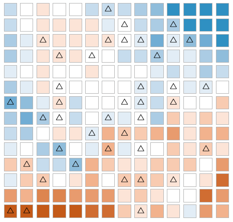
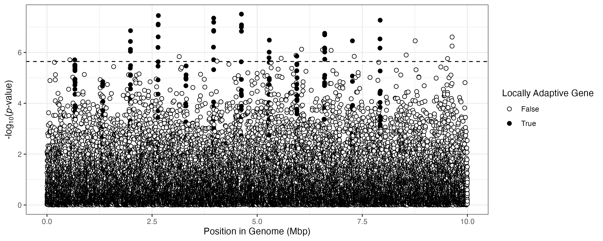
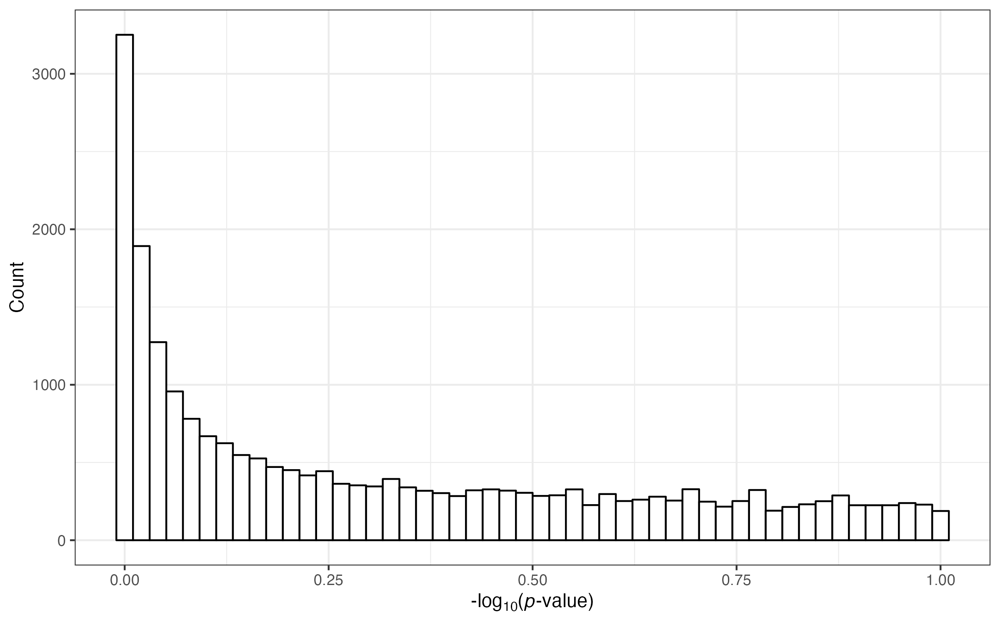
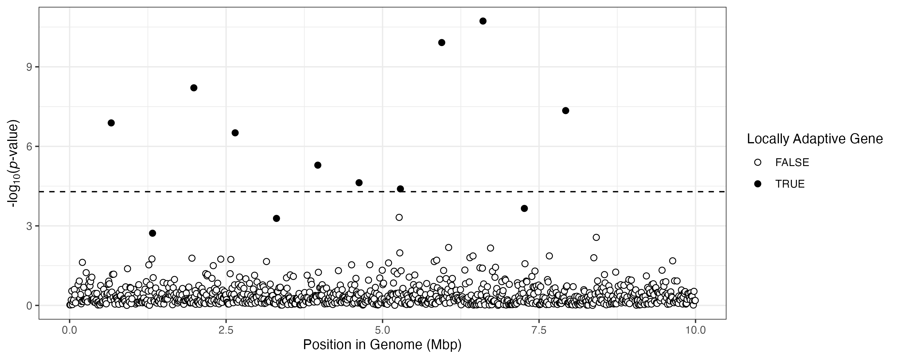
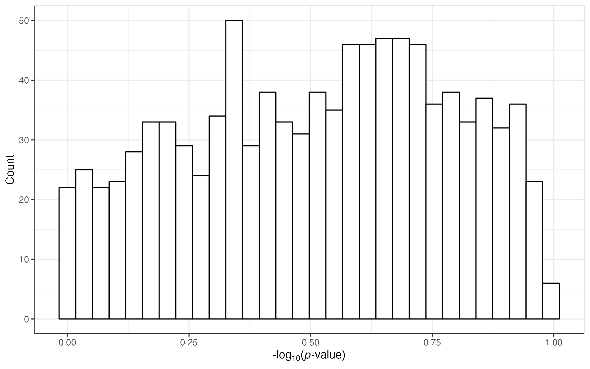

# Application of the WZA - simulation data

In the following, we'll use the WZA to analyse some simulated data.

We have allele frequency data for 40 demes sampled from the "BC Map". Below is a brief summary of how we generated this data, but see the WZA paper for full details about this map and how we simulated the data.

If you are only interested in the nuts and bolts of running the WZA, skip ahead to the section entitled **Performing the WZA**

## Simulation details.

We simulated a meta-population consisting of 196 demes, where each generation adjacent demes exchange migrants in the cardinal directions. There were 19,600 individuals in the meta-population (100 per deme). The individuals we modelled had 10Mbp genomes. This is, of course, much smaller than the kinds of genomes that are analysed in GEA studies, but computational limitation being what they are, we were only able to simulate a recombining genome of that size. The 10Mbp genome is divided into 1,000 genes (in reality, these are just 10Kbp genomic segments, we did not model exons/introns or that kind of thing).

We modelled local adaptation to a heterogeneous environment using a model of directional selection. The spatial distribution of optima in this simulation is shown in the following figure:


The triangles in this map indicate the locations of populations that were sampled. For each population, we obtained allele frequency information at each polymorphic site in the genome from a sample of 20 diplioid individuals.

# Performing the WZA

In the paper describing the WZA, we outline the steps involved in performing the WZA. They are as follows:

1. Perform GEA analysis on individual SNPs (e.g., using BayPass, RDA or Kendall’s 𝜏).
2. Rank transform summary statistics for individual SNPs (e.g., *p*-values or Bayes’ factors) into empirical *p*-values using the genome-wide distribution, then convert these into z-scores.
3. Combine z-scores within analysis windows (i.e., using Equation 1).
4. Compute a *p*-value for each analysis window while correcting for variation in SNP number across windows.

We leave Step 1 up to the user, as the input to the WZA can be any statistic, really. The script [../general_WZA_script.py](../general_WZA_script.py) handles steps 2-4. However, in this vignette we also include a simple Python script that implements an analysis using Kendall's 𝜏. Note, we use Kendall's 𝜏 (specifically version 𝜏-*b*) rather than Spearman's Rho because it is capable of calculating accurate *p*-values in the presence of ties in data.

### Perform GEA on individual SNPs

As noted above, this step could be done using various different GEA methods, e.g. *BayPass*, *RDA* or even a simple rank correlation like Kendall's 𝜏.

The genetic polymorphism data we are working with in this vignette is in the format required by the *BayPass* program. Basically, there is one row per SNP and two columns per population/deme; one with the count of major alleles, the second with the count of minor alleles. The data is in the file [data/alleleFrequencyData.txt.gz](data/alleleFrequencyData.txt.gz). Note, we Gzipped the file to make downloading this repository a little faster and to make sure we did not go over GitHub's file size limits so you'll have to use ```zcat``` or something like that if you want to take a peep at the file on your computer.

The *BayPass* format for allele frequency data looks like this:

```
13 27 6 34 9 31 3 37
0 40 0 40 1 39 0 40
3 37 0 40 0 40 1 39
```

*Note that this only shows data for the first 3 SNPs and for four of the populations. The actual data contains information for 59,806 SNPs, with information for 40 populations.*

Breaking down that first line, we have ```13 27 6 34 9 31 3 37```. You'd read this as the fist population has the reference allele at a frequency of ```13/(13+27) = 0.325```, the second population has the allele at ```6/(6+34)=0.15``` and so on. The different rows represent different SNPs.

You'll notice that this is not enough information to perform a GEA analysis as you would also need information about the environmental variation in the different populations. This information is stored in the file [data/environmentsSampled.txt](data/environmentsSampled.txt). To perform the WZA, we also need information about SNP positions in the genome and the analysis windows you are using (more on that below). The contents of the environment file looks like (again for the first four populations):

```
-4.0 3.0 -3.0 0.0
```

So the first population (the one with an allele frequency of ```0.325```) has a value of ```-4.0``` for the environmental variable we are working with.

With the data we've looked at so far, we could compute the correlation between allele frequency and the environment:

```
alleleFreq	environment
0.325	-4.0
0.150	3.0
0.225	-3.0
0.075	0.0
```

You could use a simple rank correlation analysis (e.g. using Kendall's tau) to analyse this data. This would yield a correlation coefficient as well as a *p*-value that indicates the probability of observing that correlation coefficient under the null hypothesis of no association. In this case with only 4 datapoints, such a correlation analysis would obviously be pretty underpowered, but it should give you an idea of how we'll analyse the full data. Now we'll move onto the analysis of the full data.

________________________

As noted above, there are many thousands of SNPs in the dataset we're working with here. The Python script  [bin/correlationsFromBaypass.py](bin/correlationsFromBaypass.py) implements a simple rank correlation based GEA analysis using the SNP data and the environment data we've described.

In addition, as you may have noticed, the SNP data does not indicate the genomic position of the various SNPs. We also include the file [data/alleleFrequencyMetadata.txt](data/alleleFrequencyMetadata.txt), which includes the position of each SNP, the analysis window that each SNP falls into as well as some other data that we'll use for plotting. Here's the metadata for the first 3 SNPs:

```
position,gene,LA
270.024791917764,gene0,FALSE
592.239361581393,gene0,FALSE
592.756332006305,gene0,FALSE

```

The columns in this data are as follows:
1.	```position```, this is position on a chromosome in a genome. You'll note that these are floating point numbers in our simulated data. That's because the simulation method we used represents genome sequences as continuous even though they are actually discrete in the real world. If this were real data, there'd likely be integer values in this column.
2. ```gene```, this is a categorical variable used to assign SNPs to analysis windows. Designing the windows you'll use to perform the WZA is ideally something that you would have decided on *a priori*.
3. ```LA```, this is a Boolean variable that indicates whether a particular window contains an allele that contributes to local adaptation. **You would not know this in real data analysis!!** We include it here for the sake of making graphs.


________________________

Now we have talked about the three different input files we're woring with, let's actually run our analysis on the data:

```
python3 bin/correlationsFromBaypass.py \
				--geno data/alleleFrequencyData.txt.gz \
				--env data/environmentsSampled.txt  \
				--meta data/alleleFrequencyMetadata.txt \
				--output output/simulationSingleSNP_GEA.txt
```

That commands takes about 10 seconds to run on my laptop. Let's take a look at the output of that analysis. Let's represent the data as a Manhattan plot:




Each point in the above graph is a SNP. The horizontal dashed line represents genome-wide significance. Points are filled black if they come from an analysis window that contains causal alleles.

Note that I filtered out any SNPs that had a minor allele frequency less than 5%. This is because SNPs at low allele frequency are intrinsically noisy and correlation analyses performed with such SNPs are underpowered. Removing these SNPs has a side benefit which is that it reduces the number of analyses being conducted, reducing the power-diminishing effects of multiple comparisons correction.

Let's now take a look at the distribution of *p*-values across the analysis:



Oh boy, that's a very skewed distribution of *p*-values. That indicates that there is an inadequacy in our analysis. The inadequacy is pretty obvious, it's that there is population structure in our simulated data that is aligned with environmental variation. That will cause many SNPs, including neutrally evolving SNPs, to correlate with environmental variation - leading to an excess of small *p*-values.

However, even though the analysis is problematic, you can see that there is useful information present in the distribution of *p*-values - black points tend to be higher up on the y-axis in the above Manhattan plot. This information is exactly what we try to capitalize on with the WZA.

________________________

## Running the WZA

Now we're going to perform the WZA using the results of the above analysis. As described on the main page of the repository, running the WZA is pretty straightforward. It's as simple as invoking the following command:


```

python ../general_WZA_script.py \
		--correlations output/simulationSingleSNP_GEA.txt \
		--summary_stat K_tau_p \
		--window gene \
		--output output/simulation_wza.csv \
		--retain LA position

```

As input to the WZA analysis, we use output of our single SNP analysis (from above). The argument ```--summary_stat K_tau_p``` tells the script to use the *p*-value from the Kendall's tau analysis as the input. The script converts these to empirical *p*-values and performs the WZA. It combines information within the windows indicated by the ```gene``` column in the input file.


Running the above command gave us the output file ```output/simulation_wza.csv```. That output looks like this:

```
gene,SNPs,hits,Z,top_candidate_p,LA,position,Z_pVal
gene0,57,0,-2.0832878103012424,1.0,0.0,4494.413242059327,0.9563084988924451
gene1,65,0,-2.058572352976852,1.0,0.0,14671.183943872848,0.9588150377646556
gene10,50,0,2.0504198115367185,1.0,0.0,105848.06198591145,0.26967997839529656
gene100,65,0,0.2498852556249709,1.0,0.0,1005620.1157956929,0.614153669003713
```

The columns are:
* ```gene``` - the name of the window
* ```SNPs``` - the number of SNPs in this window
* ```hits``` -  the number of SNPs in the 99th percentile (not used for anything, just good to know)
* ```Z``` - the Z score calculated for the gene
* ```top_candidate_p``` - the result of the top-candidate method of Yeaman et al (2016 - Science)
* ```LA``` - an indicator of whether the gene is causal for local adaptation
* ```position``` - the average position of all SNPs in the window
* ```Z_pVal``` - the *p*-value of the Z score (*This is the WZA score*)

Let's take a look at the WZA output:



Compare this graph to the Manhattan plot above. You'll notice that there is a better separation of non-locally adaptive genes from true positives.

The distribution of *p*-values from applying the WZA in this case looks like this:



This is obviously not a uniform istribution, but it does not have the enrichment of small *p*-values we saw before. It's up to you to decide whether you are comfortable using such a distribution of *p*-values in a frequentist manner (e.g. applying traditional significance thresholds) or to treat these *p*-values as an index of evidence (e.g. in a manner similar to Fst or other population genetic summary statistics).

________________________

The above is obviously just a single example. In the WZA paper, we performed analyses such as the above many times under many different conditions.


If there are things that you think I should add to the above vignette, or if you have questions, feel free to reach out. My email address is my_last_name [At] zoology.ubc.ca
