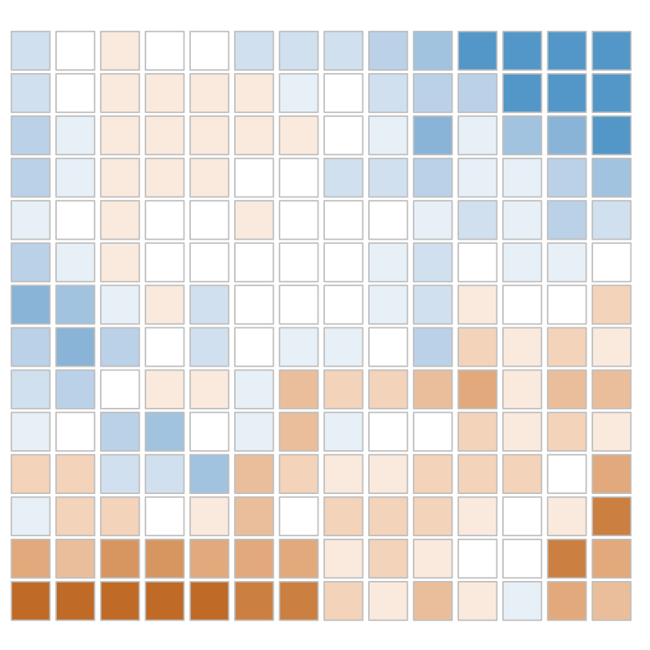

```{r setup, include=FALSE}
knitr::opts_chunk$set(echo = TRUE)
library(ggplot2)
library(Kendall)
```

In this RMarkdown, I outline application of the Weighted-Z Analysis (WZA) to simulated data. I'll give a brief description of the WZA and the simulations then start analysing some data.

I've written this document in base R as much as I can to make things portable, I use only 2 non-base packages. The first is ggplot for making pretty plots. The second is Kendall, for performing Kendall's $\tau-b$, which is not implemented in base R.

# *The WZA*

Genotype-environment association (GEA) analysis is a population genetic analysis that aims to identify genomic regions subject to local adaptation. The idea is that spatially divergent selection will lead to correlation beween allele frequencies and local environmental conditions for some sites in the genome. In a basic GEA analyses, you move along the genome looking at each marker for which you have an allele frequency estimate. For each marker you calculate the correlation between allele freqeuncy and environment. Since closely linked sites may similar evoltuionary histories, combining information across closely linked sites may increase the power of GEA analyses and help identify genomic regions subject to local adaptation. 

We propose the Weighted-Z Analysis (the WZA) as a way to combine information in a GEA analysis. We calculate a WZA score for genomic window $k$ with the following:
$$Z_{W,k} =  \frac {\sum\limits_{i=1}^n \overline{p_i} (1-\overline{p_i})z_i}{\sqrt{ \sum\limits_{i=1}^n (\overline{p_i}(1-\overline{p_i}))^2} } $$
where $n$ is the number of markers in a focal region, $\overline(p_i)$ is average ferquncy of the minor allele across populations for the $i^{th}$ SNP and $z_i$ is the standard normal deviate calculated from the one-sided $p$-value for the $i^{th}$ SNP. 

## *Simulating local adaptation*

Here I re-analyse simulation data from one simulation to demonstrate how to apply the WZA to real data.

Check the pre-print for full simulation details; but briefly, I simulated a meta-population evolving under local adaptation via stabilising selection. The meta-population was a 2D stepping-stone population that had environmental heterogeneity that looked like this:

{width=30%}

The colours indicate the phenotypic optima of each deme. Populations adapted to their phenotypic optima quite nicely. Here's a plot showing that adaptation:
```{r plotPhenotypes, echo = F}
phen <- read.csv("1_0.5_192.phen.txt")

ggplot(data = phen, 
       aes(x = opt, y = phen, fill = phen))+
    geom_jitter(width = 0.2, height = 0, shape = 21)+
  scale_fill_gradient2("", low = "#56B4E9", high = "#E69F00", mid = "white")+
  scale_y_continuous("Phenotype")+
  scale_x_continuous("Phenotypic Optimum")+
  guides(fill = F)+
  theme_bw()
```

*The colours in this plot are just for show*

In the following, I'll use the WZA to try and identify the genes that gave rise to this pattern of local adaptation.

## *Performing GEA using the WZA*


From my simulation, I estiamted allele frequencies for 40 demes across the meta-population shown above. I estimated allele freuqnecy in each deme by sampling 50 individuals (i.e. 2,000 individuals in total were sampled).
*(I like the word 'deme', but some call them populations)*
 
### Read in the environmental data

The 40 demes had a range of phenotypic optima. Let's read that data in and take a look:

```{r optima}
# Read in the environments
optima <- read.csv("environments.1_0.5_192.alleleFreqs.csv", header = F)

# convert to a numeric vector
optima <- as.numeric(optima[1,])

# inspect the vector to make sure: 
optima

# plot the distribution of values:
hist(optima, 
     breaks  = 10, 
     main = "Histogram of phenotypic optima",
     xlab = "Phenotypic Optima")
```


Of course, we are working with simulation data so we know the exact phenotypic optima of each deme. That's not likely to be case in the real world, in the real world we'd have some environmental variable like 'mean annual temperature' or 'relative humidity index' instead. We'll treat the phenotypic optima as if they were some measured variable.


### Read in and process the genetic data

Now I'll read in the genetic data. This step assumes that you have a set of allele frequencies estimated for many biallelic SNPs across the genome of your populations of interest. The file format I'm using is not a standard format (I'm not sure that there is a standard format for such analyses).

The genetic data are stored as a headerless CSV file with the following columns:

1. **Chromosome ID** - this is only here for reference with downstream analyses. If you don't care about chromosome ust make sure this column has something in it. 
2. **Position** - this variable indicates the position of each SNP in the genome.
3. **Window ID** - this is vitally important. This columns is used to determine which SNPs go with which. This could be gene IDs or the coordinates of an analysis window.

Columns 4 to $n+3$ are the allele frequency estimates for each of the $n$ demes sampled. 

*Note* that the order of the demes in the CSV files has to match the order of the environments in the environments vector!

```{r read_SNP_data}
# read in the data
all_data <- read.csv("1_0.5_192.alleleFreqs.csv", header = F)


# Let's split the data so that we have an allele freq. dataframe and a dataframe with SNP info
snps_all <- all_data[,1:3]
# Let's put some names on the data to make things easier downstream
names(snps_all) <- c("CHROM","POS","GENE")

# let's take a look at the data, there should be SNPs in gene0 on chromosome 1 
str(snps_all)
# There's information on 66421 SNPs across the genome

# extract frequency data for each SNP
freqs_all <- all_data[,4:43] # There are 40 demes in the dataset, so columns 4 to 43 represent all the demes

# take a look at the freuqency for the first SNP
as.numeric(freqs_all[1,])

# As you can see, most SNPs are at a low minor allele frequency - we remove the low frequency ones before applying the WZA.

# The first thing we'll do is calculate the average allele frequency across populations for each SNP and add it to the SNP info dataframe
snps_all$p_bar <- apply(freqs_all, 1, mean)
snps_all$q_bar <- 1 - snps_all$p_bar

# take the minimum to get the MAF
snps_all$MAF <- pmin(snps_all$p_bar, snps_all$q_bar)

# now we'll apply the MAF filter to the data
snps <- snps_all[snps_all$MAF >= 0.05, ]
freqs <- freqs_all[snps_all$MAF >= 0.05, ]

str(snps)
# Now we only have 23,324 SNPs in the dataset

```

### Perform GEA on each SNP

Now we need to actually perform GEA on each SNP. There are number of different ways that one could do this step in R, we'll use Kendall's $\tau$ as it can handle ties in the data.

```{r GEA_using_Kendall}
# Make a little wrapper function for cor.test to return the summary stat and the p-value as a vector
cor_test_wrapper <- function(p_vec, env_vector){
  correlation_result <- cor.test(p_vec, env_vector, method = "kendall", exact = F)
  return(c(correlation_result$estimate,
           correlation_result$p.val))
}

## Use the apply function to use the wrapper function on each line of the DF - this step takes a while...
cor_results <- apply( as.matrix(freqs),
               1,
               function(x) cor_test_wrapper(x, optima))

# transpose the result and store as a dataframe
cor_results <- as.data.frame(t(cor_results))

# give the column informative names
names( cor_results ) <- c("Kendall", "p_val")

# combine the result with the SNP table
snps <- cbind(snps , cor_results)
min(snps$p_val)


```

Ok, so now we've performed GEA on each SNP and have a table of results that can be easily plotted or analysed further. First, let's take a look at a histogram of p-values from the Kendall's $\tau$ GEA then I'll look at the Manhattan plot of p-values.

For a neutrally evolving chromosome, ideally the distribution of p-values to be uniform. Of course they are not expected to be uniform due to a) isolation-by-distance and b) isolation-by-adaptation.

```{r Plot_pVals}
# Here's a histogram for SNPs present on a neutrally evolving chromosome
ggplot(data = snps[snps$POS >800000,],
       aes(x = p_val))+
  geom_histogram( bins = 50)+
  scale_y_continuous("Count")+
  scale_x_continuous(expression(italic(p)*"-value"))+
  theme_bw()

## Let's take a look at a Manhattan plot of these results:
ggplot(data = snps, 
       aes(x = POS/1e6, 
           y = -log10(p_val),
           fill = p_bar*q_bar))+
  geom_point(shape = 21)+
  geom_hline(aes(yintercept = quantile(-log10(p_val), 0.99)), col = "red", lty = 2, lwd = 1)+
  scale_fill_gradient(expression(italic(bar(p)*bar(q))), low = "white", high = "black")+
  scale_y_continuous(expression(-log[10]*"(p-value)"), limits = c(0,10))+
  scale_x_continuous("Position (Mbp)")+
  theme_bw()


```

Ok, now let's take this data and perform the WZA using the data...


We will end up with results for 1,000 genes...

```{r prep_WZA}

# The first thing we'll do is convert the parametric p-values from Kendall's tau to empirical p-values
snps$empirical_p <- rank(snps$p_val)/length(snps$p_val)

## Plot those out p-values - it should look like a squashed version of the above Manhattan plot...

ggplot(data = snps, 
       aes(x = POS/1e6, 
           y = -log10(empirical_p),
           fill = p_bar*q_bar))+
  geom_point(shape = 21)+
  geom_hline(aes(yintercept = quantile(-log10(empirical_p), 0.99)), col = "red", lty = 2, lwd = 1)+
  scale_fill_gradient(expression(italic(bar(p)*bar(q))), low = "white", high = "black")+
  scale_y_continuous(expression(-log[10]*"(p-value)"), limits = c(0,10))+
  scale_x_continuous("Position (Mbp)")+
  theme_bw()
```


```{r WZA}

# Now convert the empirical p-values to z scores
snps$z_score <- qnorm(snps$empirical_p, lower.tail = F)
head(snps)
# For convenience, let's calculate p_bar*q_bar and store it in the DF 
snps$pbar_qbar <- snps$p_bar*snps$q_bar

# Now let's calculate the WZA for each gene
WZA_numerator <- tapply(snps$z_score*snps$pbar_qbar,
                        snps$GENE,
                        sum)
WZA_denominator <- sqrt( tapply(snps$pbar_qbar*snps$pbar_qbar, 
                          snps$GENE, 
                          sum)**2 )
WZA <- WZA_numerator/WZA_denominator


pos <- tapply(snps$POS,
              snps$GENE,
              mean)

WZA_df <- data.frame(WZA = WZA, 
                     gene = genes,
                     pos = pos)

  
```

Now we have a dataframe called `WZA` that contains a WZA score for each gene in the genome. 

Let's analyse the WZA scores a bit:

```{r analyseWZA}

ggplot(data = WZA_df, aes( x = WZA))+
  geom_histogram( bins = 50)+
  scale_y_continuous("Count")+
  theme_bw()
# This is clearly a fatter distribution that you'd see under the standard normal distribution...


# Now let's plot out the result:
ggplot(data = WZA_df, aes( x = pos, y = WZA))+
  geom_point( )+
  scale_y_continuous("Count")+
  theme_bw()+
  scale_x_continuous("Position (Mbp)")+
  theme_bw()

```

